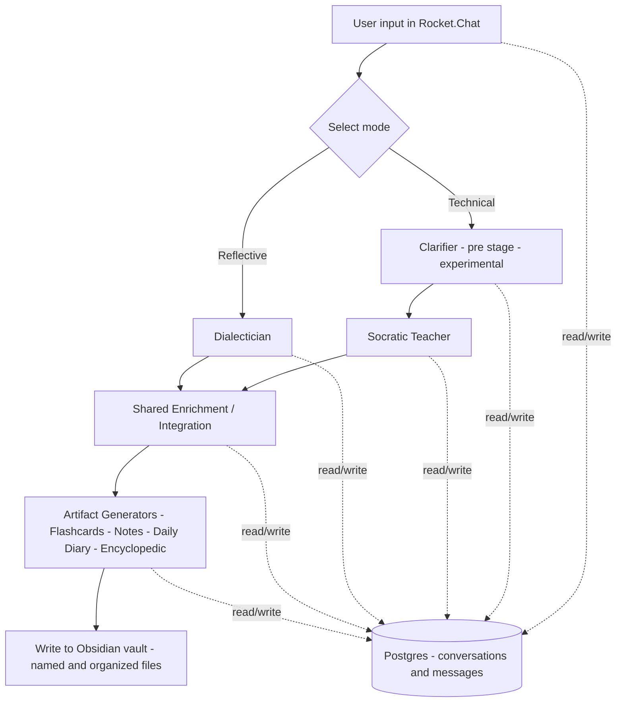

# Multi-Agent Learning Pipeline

## Overview

This project is a multi-stage AI learning system designed to improve learning through structured dialogue and automated knowledge capture.

The system supports two distinct interaction modes:

- **Socratic Teacher** — A technical tutor focused on coding, mathematics, and structured problem solving.
    
- **Dialectician** — A collaborative discussion agent focused on psychology, philosophy, and reflective exploration.
    

Both modes feed into a shared enrichment stage and an integrated artifact generation pipeline that writes structured study materials directly into an Obsidian vault.

A major focus of this project was **instruction-set engineering**: designing role-specific prompts to reliably produce the intended learning behavior and structured outputs across stages.

---
Repository Scope

This repository documents the architecture, workflow structure, and instruction-set design of the system.

It is not packaged as a turnkey deployment. Environment-specific configuration (e.g., credentials, runtime setup, Rocket.Chat integration details) has been intentionally excluded.

The focus of this repository is architectural clarity and system design rather than production deployment.
---

## Core Design Principles

- **Dialogue-centered learning**
    
    - The primary learning happens in conversation (Socratic teaching or reflective dialectic), not in the artifacts themselves.
        
- **Separation of roles**
    
    - Each stage has a clearly defined responsibility (teach/explore, clarify, enrich, generate artifacts).
        
- **Structured contracts**
    
    - Stages hand off **structured JSON** to reduce ambiguity and improve predictability.
        
- **Knowledge externalization**
    
    - Dialogue is converted into durable artifacts that appear automatically in an Obsidian vault (named and organized).
        

---

## Interaction Modes

### Socratic Teacher (Technical lane)

Designed for:

- Programming problems
    
- Algorithms and reasoning
    
- Mathematics / technical learning
    

The Socratic agent:

- Guides via scaffolded questions
    
- Emphasizes reasoning and clarity
    
- Avoids “solution dumping” when the goal is learning
    

**Clarifier (technical pre-stage):**

- The clarifier runs **before** the Socratic teacher when you select the technical lane.
    
- Its purpose is to remove ambiguity and package assumptions into structured JSON for the Socratic agent.
    
- This component was experimental; it existed to test whether a dedicated clarification pass improved learning outcomes and reduced back-and-forth.
    

### Dialectician (Reflective lane)

Designed for:

- Psychology and philosophy
    
- Personal meaning-making
    
- Conceptual exploration and refinement
    

The Dialectician:

- Acts as a collaborator rather than a tutor
    
- Focuses on exploration, contrast, and interpretation
    

---

## Shared Enrichment Stage

Regardless of lane (Socratic or Dialectician), sessions flow into a common enrichment stage.

This stage:

- Consolidates the transcript
    
- Extracts and structures key learning points
    
- Prepares content for artifact generation
    

---

## Integrated Artifact Generation

Artifact generation is an integral part of the system.

After enrichment, the pipeline generates:

- Structured reference notes
    
- Session debrief summaries / daily diary
    
- Flashcards
    
- Encyclopedic-style notes
    

Artifacts are written directly to disk and appear in an Obsidian vault with consistent naming and folder organization.

---

## Architecture Overview

Tech stack:

- n8n (workflow orchestration)
    
- Postgres (persistent conversation state)
    
- Docker (containerized deployment)
    
- LLM APIs (agent execution)
    
- File-system integration (write artifacts into an Obsidian vault)
    

---

## System Flow Diagram

  

  
---

## Conversation State (Postgres)

- Conversations are upserted and tracked.
    
- Messages are stored with ordered sequencing.
    
- Session context can be reconstructed from persisted history.
    
- State consistency is maintained via transactional querying patterns.
    

---

## Instruction-Set Engineering

A major focus of this project was designing **role-specific instruction sets** that:

- Produce reliably different behavior per agent (tutor vs dialectician vs clarifier vs enrichment)
    
- Enforce structured JSON output where needed
    
- Reduce ambiguity during handoffs
    
- Improve learning outcomes through consistent interaction style
    

---

## What This Project Demonstrates

- Multi-lane agent orchestration (technical vs reflective)
    
- Instruction-set engineering and behavior shaping
    
- Stateful workflow design with persistent memory
    
- Contract-driven JSON handoffs between stages
    
- Automated knowledge externalization into an Obsidian vault
    

---

## Repository Structure

- `workflow/` — exported n8n workflow JSON
    
- `docs/` — optional deeper writeups (architecture + instruction design)
